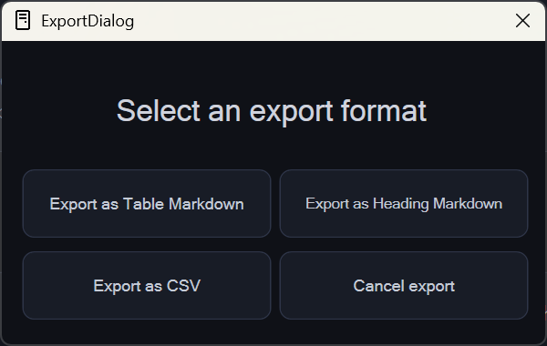
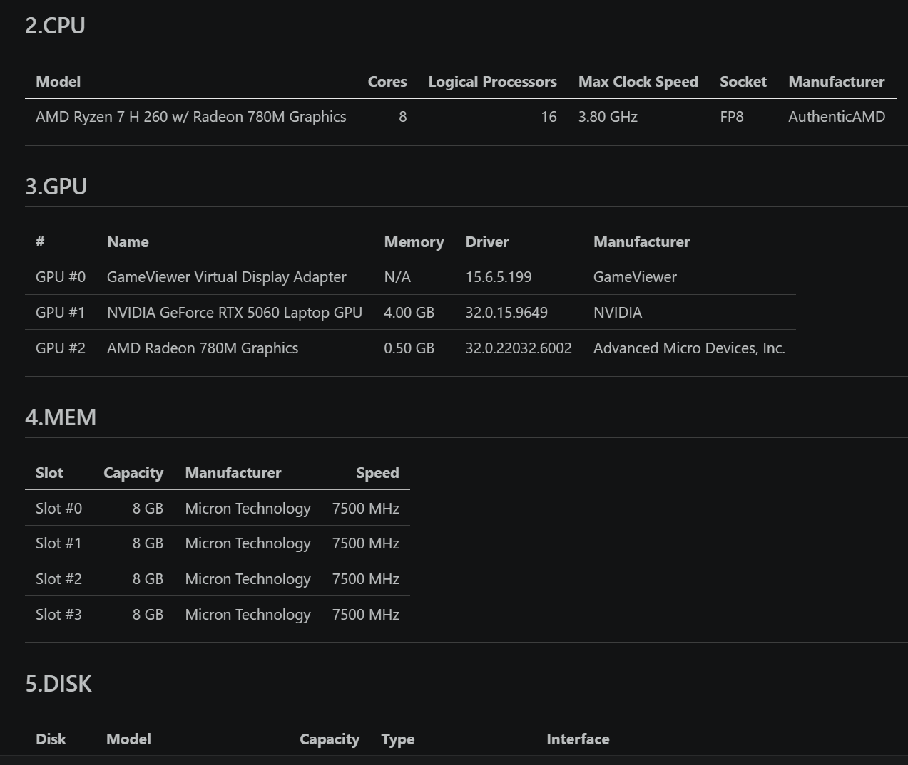
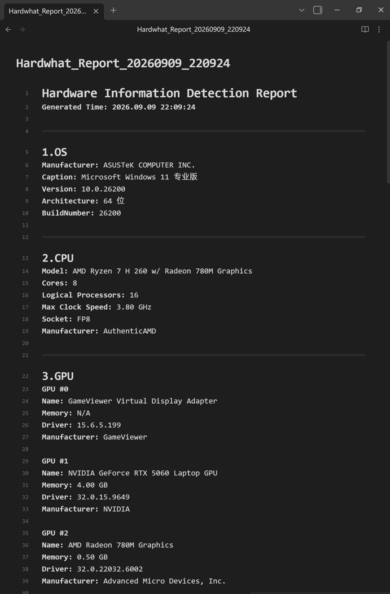
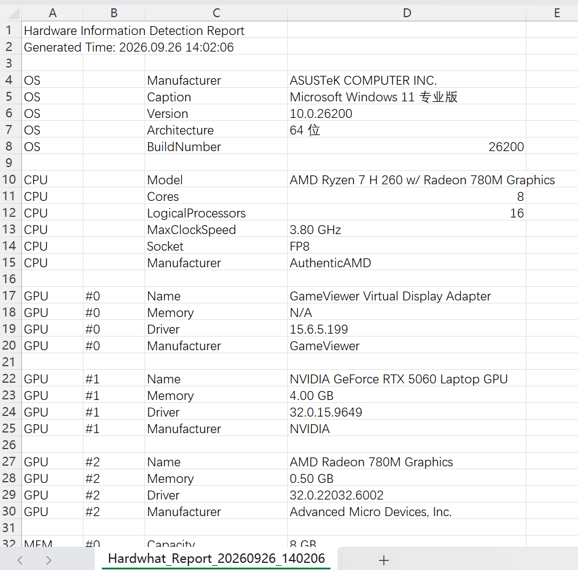

# Hardwhat
An WPF (.NET Framework) app for checking hardware information
---
### English | [简体中文](docs/README-zh.md)

Built on .NET Framework and uses **WMI** (Windows Management Instrumentation) to query hardware information.
This project is under GPL-3.0 **(Except sidebar and window icons)**.

**⌃ Start Page**

**⌃ Query result view**

With a clean and intuitive UI, you can easily explore your:

`🪟 OS` `⚡ CPU` `🎮 GPU` `🧠 Memory` `💾 Disk` `🖥️ Motherboard` `🌐 Network` `🔊 Audio`

**Main Logic is in `MainWindow.xaml.cs` and Design is in `MainWindow.xaml`**

## Hardwhat 2.0 New Feature: Export the query result in 3 ways
Click the `Export icon`, you can choose as a Table-style or Heading-style `.md` or `.csv`

**⌃ Export dialog**

**⌃ Table-style Markdown**

**⌃ Heading-style Markdown**

**⌃ CSV**

All icons are derived from [Lucide](https://lucide.dev) and converted to XAML Path, licensed under the [ISC License](docs/LICENSE-Lucide).

> 💡 *This is my second GitHub repository. Any ideas or suggestions are welcome in [Issues](https://github.com/Easzzz/Hardwhat/issues).*

> ⭐ *If you find this project useful, a star would be appreciated~*

   