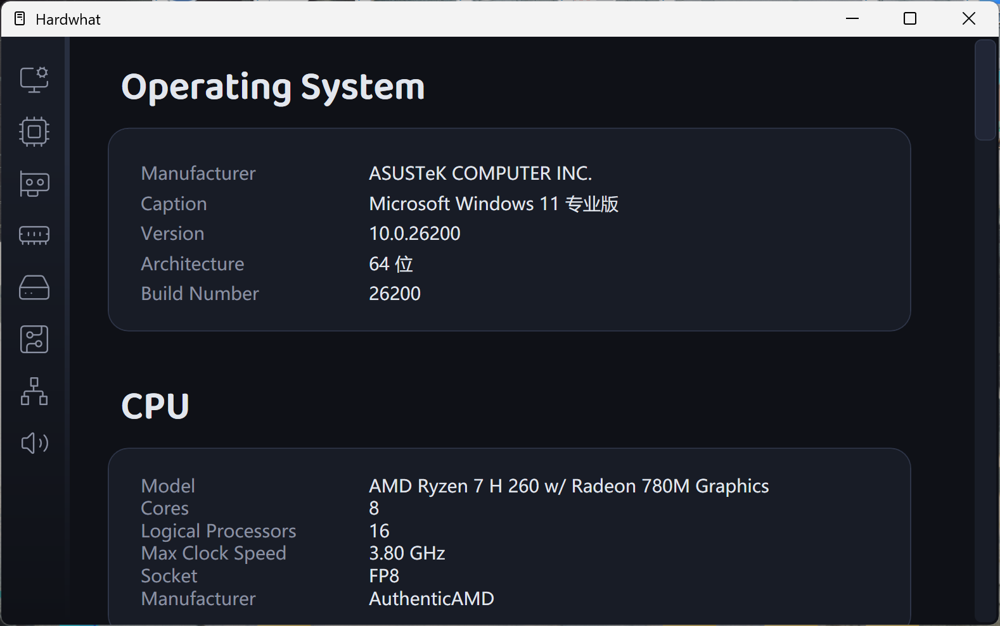

# Hardwhat
用于查看硬件信息的 WPF (.NET Framework) 应用程序
---
### [English](../README.md) | 简体中文

基于 .NET Framework，通过 **WMI** (Windows Management Instrumentation) 查询硬件信息。
采用 GPL-3.0 许可证（**侧边栏和窗口的图标除外**）。

**⌃ 开始页**

**⌃ 查询结果页**

在优雅的 GUI 里查询下面的硬件信息多是一件美事啊（

`🪟 系统` `⚡ CPU` `🎮 显卡` `🧠 内存` `💾 硬盘` `🖥️ 主板` `🌐 网卡` `🔊 声卡`

**逻辑文件 `MainWindow.xaml.cs`，设计 `MainWindow.xaml`**

所有图标均为 [Lucide](https://lucide.dev) 的 Icons 转译为 XAML Path 而成，是在 [ISC License](LICENSE-Lucide) 下的合法行为。

> 💡 *欢迎来 [Issues](https://github.com/Easzzz/Hardwhat/issues) 吹水。*

> ⭐ *万水千山总是情，给个 Star 行不行~*

   